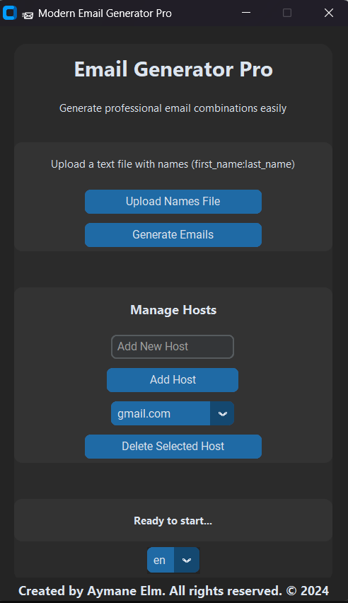

# 📨 **Modern Email Generator Pro**

**Modern Email Generator Pro** is a Python-based desktop application that allows users to easily generate professional email combinations from a list of names. This tool supports multiple email domains, file uploads for name processing, and provides a sleek, modern interface powered by **CustomTkinter**. With multi-language support (English and French), it ensures a versatile and user-friendly experience for all users.

<div align="center">

</div>

## Features 🚀

- **Generate Professional Email Combinations**:  
  Automatically create various email combinations from first and last names, such as:
  - `first.last@domain.com`
  - `last.first@domain.com`
  - `firstlast@domain.com`
  - `first@domain.com`
  - `firstl@domain.com`

- **Customizable Hosts**:  
  Add and remove custom email domains directly from the user interface (e.g., `gmail.com`, `yahoo.com`, `hotmail.com`).

- **File Upload Support**:  
  Upload a `.txt` file containing names formatted as `first_name:last_name` to generate emails automatically.

- **Multi-language Support**:  
  The app supports **English** and **French** with an easy-to-use language dropdown.

- **Persistent Host Management**:  
  Your custom email hosts are saved in a `hosts.json` file, ensuring preferences are remembered between sessions.

- **Organized Output**:  
  Generated emails are stored in a folder named `Emails Generated`, with files numbered sequentially (e.g., `Emails_Combination_1.txt`).

- **Real-time Status Updates**:  
  The app provides real-time status messages for actions like file uploads, email generation, and error handling.

---

## Installation 💻

### Prerequisites 🛠️

Make sure you have **Python 3.x** installed. The application also requires the `customtkinter` library to create the modern GUI.

### Install Dependencies 📦

You can install the required Python dependencies by running the following command in your terminal:

```bash
pip install customtkinter
